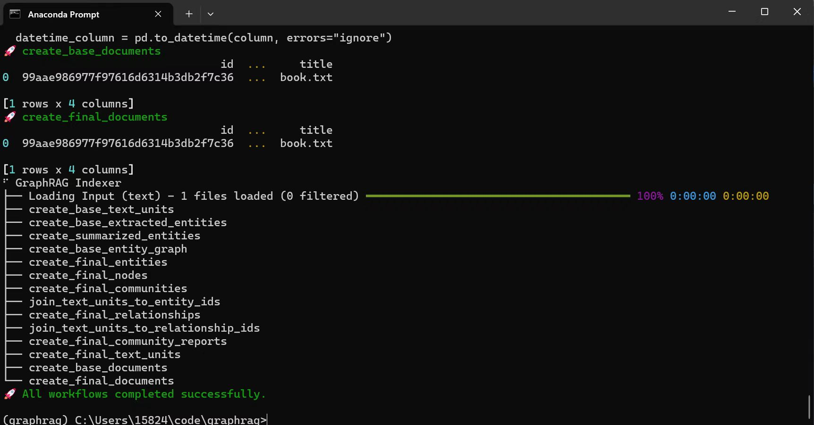

# AIAssistant-on-UM790Pro-Accerated-by-ROCm
For AMD Pervasive Contest, using ROCm to support and accelerate LLMs running on UM790Pro AIPC, also enables local RAG.

## Contents

- [AIAssistant-on-UM790Pro-Accerated-by-ROCm](#aiassistant-on-um790pro-accerated-by-rocm)
  - [Contents](#contents)
  - [Task Brief](#task-brief)
    - [Choice of Acceleration Hardware](#choice-of-acceleration-hardware)
      - [GPU](#gpu)
  - [NPU](#npu)
  - [Build LLM Inference Server](#build-llm-inference-server)
    - [Add gfx1103 support for LM-Studio with ROCm](#add-gfx1103-support-for-lm-studio-with-rocm)
      - [Build rocblas for gfx1103](#build-rocblas-for-gfx1103)
      - [Install LM-studio](#install-lm-studio)
      - [Test(llama3.1-8B)](#testllama31-8b)
  - [Frontend and Usages of LLM Server](#frontend-and-usages-of-llm-server)
    - [Local RAG](#local-rag)
      - [Setup Up AnythingLLM](#setup-up-anythingllm)
      - [test with Q\&A with FlashAttention 1,2,3 paper pdf](#test-with-qa-with-flashattention-123-paper-pdf)
    - [Web browsing RAG](#web-browsing-rag)
    - [GraphRAG on local LLMs](#graphrag-on-local-llms)
      - [Setup GraphRAG environment](#setup-graphrag-environment)
      - [Run example](#run-example)
      - [Update Settings to use local LLMs](#update-settings-to-use-local-llms)

## Task Brief
The task is to support and accelerate LLMs running on UM790Pro AIPC, also enables local RAG, which helps users to work efficiently and privately.

### Choice of Acceleration Hardware
**Why I choose GPU instead of NPU for acceleration?** 

The UM790Pro AIPC features both GPU and NPU accelerators. Here, I will explain why, at present, using the GPU for acceleration is a better choice, focusing on computing capabilities and usability, including community support.

**As is widely recognized, LLM inference tasks are more memory-bound compared to CNN-type models. Therefore, the computing capabilities of a certain type of accelerator may not directly correlate with inference performance.**

#### GPU
***Computing Capabilities***

Running at 2.9GHz, the processor can deliver [4.51 TFLOPS](https://www.cpu-monkey.com/en/igpu-amd_radeon_780m) of FP32 performance, 9.03 TFLOPS of FP16 performance, and potentially **18.04 TOPS** of INT8 performance(4 times FP32). The INT8 performance figures are supported by [AMD's documentation](https://www.amd.com/zh-cn/newsroom/press-releases/2024-4-16-amd-expands-commercial-ai-pc-portfolio-to-deliver-.html), which indicates that the 8945HS model achieves 39 TOPS. By subtracting the 16 TOPS attributed to XDNA (the only significant difference from the 7945HS model) and adjusting for other CPU differences, we can infer the INT8 performance for this processor.

***Usability***

Granted with more support from OpenCL and ROCm (not fully supported officially by AMD, but we will address this later).

## NPU 
***Computing Capabilities***

NPU in UM790Pro(7940HS) is capable of Up to **10 TOPS** in [AMD's documentation](https://www.amd.com/en/products/processors/laptop/ryzen/7000-series/amd-ryzen-9-7940hs.html). 


Test results indicate that longer token lengths result in lower and more volatile NPU utilization rates. The command center shows an average NPU utilization of 70%.


In the above pictures, the first test ranges from 4 to 256 tokens, while the second test ranges from 512 to 4096 tokens, both increasing by a factor of 2.

***Usability***

However, the NPU is not as widely supported as the GPU in terms of **Ops** and **Quantization** by the community. After I tried [examples](https://github.com/amd/RyzenAI-SW) for the NPU, I found it to be **less flexible** and requiring **more time for adaptation** for each LLM model.

## Build LLM Inference Server
### Add gfx1103 support for LM-Studio with ROCm
#### Build rocblas for gfx1103
I refer to this page to help me rebuild rocblas for gfx1103 on Windows: [ROCm-Developer-Tools/rocBLAS](https://www.bilibili.com/read/cv34438089/?jump_opus=1). Or you can download it from [link](https://github.com/likelovewant/ROCmLibs-for-gfx1103-AMD780M-APU).
And you can get the following files:


#### Install LM-studio
VERY IMPORTANT: You need to install windows version and get ROCm extension instead of ROCm preview from lmstudio.ai, which in my tries exposes few unsolved problems. Then install additional support for ROCm.

```bash
LM-Studio-0.2.28-Setup 
```
After this setup, run the folling command in Powershell to add support fot ROCm.

**please first delete everything in your %USERPROFILE%\\.cache\lm-studio\extensions\backends (Windows).**

```
Invoke-Expression ([System.Text.Encoding]::UTF8.GetString((Invoke-WebRequest -Uri https://files.lmstudio.ai/windows/extension-pack-install-scripts/win-rocm-0.2.27-ext-install.ps1 -UseBasicParsing).Content))
```
Alter backend-manifest.json in C:\Users\15824\\.cache\lm-studio\extensions\backends\win-llama-rocm-lm\ and add gfx1103 in "targets". The result should look like:
```json
{
  "name": "ROCm llama.cpp",
  "version": "1.1.0",
  "engine": "llama.cpp",
  "target_libraries": [
    {
      "name": "llm_engine_rocm.node",
      "type": "llm_engine",
      "version": "0.1.1"
    },
    {
      "name": "liblmstudio_bindings_rocm.node",
      "type": "liblmstudio",
      "version": "0.2.25"
    }
  ],
  "platform": "win",
  "cpu": {
    "architecture": "x86_64",
    "instruction_set_extensions": [
      "AVX2"
    ]
  },
  "gpu": {
    "make": "AMD",
    "framework": "ROCm",
    "targets": [
      "gfx1030",
      "gfx1100",
      "gfx1101",
      "gfx1102",
      "gfx1103"
    ]
  },
  "supported_model_formats": [
    "gguf"
  ],
  "manifest_version": "2",
  "vendor_lib_package_name": "win-llama-rocm-vendor"
}
```
Besides, replace old rocblas.dll(C:\Users\15824\.cache\lm-studio\extensions\backends\vendor\win-llama-rocm-vendor) and library fold(C:\Users\15824\.cache\lm-studio\extensions\backends\vendor\win-llama-rocm-vendor\rocblas) with the new one you build.


Then, download ollama ollama-windows-amd64.zip from [link](https://github.com/likelovewant/ollama-for-amd/releases). And replace the old llama.dll(C:\Users\15824\\.cache\lm-studio\extensions\backends\win-llama-rocm-lm) with Ollama's llama.dll(in ollama-windows-amd64\ollama_runners\rocm_v5.7).

#### Test(llama3.1-8B)
Test with the newest model: Llama3.1-8B with 8-bit precision. When you load the model, you should see the same output as in the picture below, indicating that the model has been successfully loaded with llama.cpp support on the ROCm backend.


Ask a few questions:


Token Generation Speed compared with NPU:
Note that it is not a fair comparison.
Llama3.1 8B 8bit


Llama2 7B chat 4bit


| Model | Llama2-FlashAttn-AWQ-4bit | Llama3.1-8B.Q8_0.gguf | llama-2-7B-chat.Q4_0.gguf |
| --- | --- | --- | --- |
| DEVICE | AIE(NPU) | GPU(780M) | GPU(780M) |
| Token/s | 3.8 | 8.22 | 14.50 |


## Frontend and Usages of LLM Server
### Local RAG
#### Setup Up AnythingLLM
First, Downliad anythingllm desktop.
Second, Set the LLM preference in settings of AntyhingLLM to LMStudio, and let the app auto detect the ip of the server, as well as the model.


Third, you can pick the embedding models, either the default from anythingllm or the one from LMStudio.

Finally, in agent skills. Open Web Search, and select Google Search Engine(because it is free). Enter your Search engine ID and Programmatic Access APIKey.


#### test with Q&A with FlashAttention 1,2,3 paper pdf
Local RAG with FlashAttention 1,2,3 paper pdf.
First, you should add the pdf file to the vector database. Something like this:


Then, ask questions concerning the pdf file. You can see the results below, which is quite accurate:


Here is the original Figure1 in pdf.


### Web browsing RAG
After setting up Google Search Engine, you can ask questions outside the training knowledge. 
Select Web Search in Agent Skills, 


Then, you can search the web
and ask questions. You can see the results below:


The output is different from local vector base RAG, and it will be much slower, for it precesses the web search in real time.

### GraphRAG on local LLMs
We use the [example](https://microsoft.github.io/graphrag/posts/get_started/) given by Microsoft.
#### Setup GraphRAG environment
Prepare the conda env in the [getting start page](https://microsoft.github.io/graphrag/posts/get_started/).


#### Run example
First, put book.txt from example into "input" folder.
Second, run init:
```bash
> python -m graphrag.index --init --root ./ragtest
```

#### Update Settings to use local LLMs
```yaml
encoding_model: cl100k_base
skip_workflows: []
llm:
  api_key: lm-studio #${GRAPHRAG_API_KEY}
  type: openai_chat # or azure_openai_chat
  model: Meta-Llama-3.1-8B-Instruct-GGUF 
  model_supports_json: true # recommended if this is
  api_base: http://localhost:1234/v1 #https://
  tokens_per_minute: 10_000 # set a leaky bucket throttle
  requests_per_minute: 10 #_000 # set a leaky bucket 
  sleep_on_rate_limit_recommendation: true # whether to 

embeddings:
  ## parallelization: override the global parallelization settings for embeddings
  async_mode: threaded # or asyncio
  llm:
    api_key: lm-studio #${GRAPHRAG_API_KEY}
    type: openai_embedding # or azure_openai_embedding
    model: nomic-ai/nomic-embed-text-v1.5-GGUF
    api_base: http://localhost:1234/v1
    tokens_per_minute: 10_000  throttle
    requests_per_minute: 10 
```

Then, run the following command to index the book.txt:
```bash
> python -m graphrag.index --root ./ragtest
```

The cmd should output like this:

The background is the output of LM-studio inference server.

Local RAG with GraphRAG results are in [ragtest](./ragtest/) and [ragtest-long](./ragtest-long/) foler. You can see the results in responding log files.
